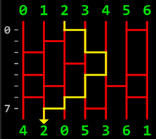

[Amidakuji](https://en.wikipedia.org/wiki/Ghost_Leg) is a method of lottery designed to create random pairings between two sets comprised of an equal number of elements.

Your task is to write a function amidakuji that returns the final positions of each element. Note that the elements are an ascending sequence of consecutive integers starting with 0 (from left to right).

#### Input

Your function will receive an array/list of equal-length strings consisting of 0 and 1 characters; this represents the "ladder" structure. The 1s represent the rungs of the ladder and the 0s represent empty space.
Each element begins at the top of its corresponding vertical rail, as illustrated in the diagram below.

#### Output

Your function should return an array of integers, with each integer in its final position.

Test Example



The diagram above is a visual representation of the test example below. The yellow highlighted path shows the path taken by the 2 value. Each time it encounters a crosspiece, it shifts position.
```javascript
let ladder = [
    '001001',
    '010000',
    '100100',
    '001000',
    '100101',
    '010010',
    '101001',
    '010100'
];

amidakuji(ladder); // [4, 2, 0, 5, 3, 6, 1]
```
